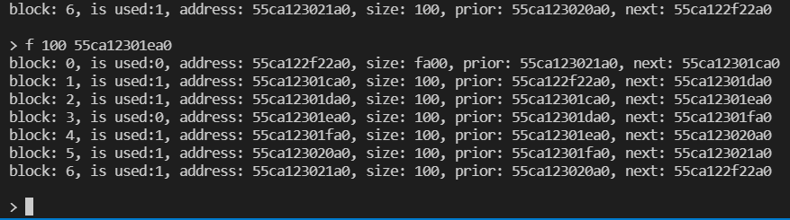

# 实验一 可变分区存储管理

## 一、实验题目

编写一个C语言程序，模拟UNIX的可变分区内存管理，使用循环首次适应法实现对一块内存区域的分配和释放管理。

## 二、算法思想及数据结构

不同于固定分区存储，可变分区存储无需事先将内存划分为分区进行管理。相反，它通过在运行时根据需要动态为程序分配内存和回收来对内存进行管理，这要求我们通过程序维护相应的数据结构来标记内存的申请与释放。

在代码实现中，这一信息的记录主要依赖

```C
struct map
{
    // If this map is used, this value will be set to 1, else to 0.
    uint64 isused;
    // The size that map manages.
    uint64 m_size;
    // The real start address.
    char *m_addr;
    struct map *next, *prior;
};
```

该数据结构用来记录每一块内存的使用情况。其中`isused`用来标记该内存块是已分配还是未分配状态，`m_size`用来记录内存块大小，`m_addr`用来记录内存的起始地址，`next`、`prior`指针用来维护`map`双向链表，用来标记每一节点的前驱节点和后继节点，同时首尾节点相互链接，形成环状链表。

为了标记程序运行时的相关信息，在`memory.h`文件中声明了三个全局变量，`void mem`，`struct map *head`，`struct map *cur`。`mem`用来记录管理当前的整个内存，利用`malloc`进行内存的申请和`free`进行内存的释放。`head`用来保存链表的头部。为了实现循环首次适应法，`cur`用来标记上一个被申请分配的内存块，已帮助我们快速找到下一个空闲节点。

实现分配与释放的关键函数分别是`void *lmalloc(uint64 size)`和`void lfree(uint64 size, char *addr)`，接下来将介绍两个函数的实现思路。

`lmalloc`用于分配指定大小的内存并返回其指针，如果没有合适的内存则返回空指针。当函数开始执行时，先从`cur`指针开始遍历链表，找到大小合适的节点并保存下来并将`cur`指针指到下一个空闲块。接着对节点进行分析，如果大小恰好等于需求的大小，那么将使用位置为1并返回其地址，否则创建新节点对内存块进行分割，从尾部开始分割出大小合适的块，创建`map`对象对其进行管理并添加到链表中，再将新创建的节点使用位置1。

`lfree`用于回收指定地址和大小的内存块，如果未找到信息相符的内存块则打印错误信息并直接返回。首先函数遍历链表找到目标内存块，接下来对其进行释放并进行内存整理。内存整理的情况比较复杂，接下来我们对其进行分类讨论。

在`lfree`中，合理的释放内存共有四种允许的情况，它们分别是：

- 释放内存块不位于内存首尾且前后内存块都为空闲块。这样的内存块需要以前驱内存块为基准对自身和后继内存块进行合并。
- 释放内存块不位于内存首尾且前驱内存块为空闲块，后继内存块为使用块，或者位于内存尾且前驱内存块为空闲块。这样的内存块需要以前驱块为基准对其自身进行合并。
- 释放内存块不位于内存首尾且前驱内存块为使用块，后继内存块为空闲块，或者位于内存头且后继内存块为空闲块。这样的内存块需要以自身块为基准对后继块进行合并。
- 释放内存块不位于内存首尾且前后内存块都为使用块，或者位于内存头且后继节点为使用块，或者位于内存尾且前驱节点为使用块。这样的内存只需要将空闲位置0即可。

可以用图表示为以下四种情况


对这四种情况分别进行处理。对于第1种情况，将前驱内存块的内存大小增大释放内存块内存大小和后继内存块大小并释放后两个节点。对于第2种情况，将前驱内存块的内存大小增大释放内存块内存大小并释放节点。对于第3种情况，将后继节点的内存大小增大释放内存块的大小并将后继节点的起始位置移到释放内存块的开始并释放节点。对于第4种情况，只需要简单地将使用位置0即可。对于不属于以上四种情况的内存释放请求，打印错误信息。

值得讨论的一个问题是`cur`指针指向的节点可能失效导致下一次内存分配错误吗？答案显然是不可能的，因为每次完成分配后总是保证`cur`指针指向一个空闲块，而`lfree`只对分配块执行，因此`cur`指针指向的对象不可能被释放，也就不存在悬垂指针的风险。

## 三、输入输出

输入输出部分在`main.c`文件中实现。用户可以使用`m <size>`的指令申请目标大小的地址，也可以使用`f <size> <address>`的指令释放掉目标地址和大小的已用内存块。注意输入输出都采用16进制的格式。

## 四、测试结果

由于采用真实地址进行管理，因此每次执行程序都很难预测分配到的地址位置，不适宜于通过输入输出重定向进行快速检测，这里将通过手动输入示例展示结果。

编写`Makefile`文件，在命令行输入`make`指令编译并执行程序如下图


接下来连续分配多个内存块如下图


可以看到正常打印了刚刚分配的内存块和未分配的一大块空闲内存块，接下来尝试释放其中一个内存块



可以看到被释放的内存块被标记为空闲块，接下来尝试释放一个邻近内存块


可以看到被释放的内存块和邻近的空闲块发生了合并，接下来尝试将小空闲块与大空闲块连接起来


可以看见空闲块正确地发生了合并。

如上是对实验结果的简单手动测试，在以上的步骤中内存管理均正确显示信息。

## 附录

Github地址：[lab1](https://github.com/sgjzfzzf/SJTU_IS217-1)